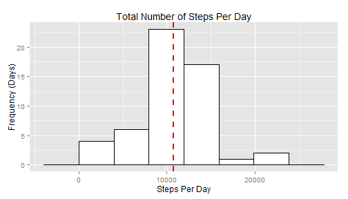
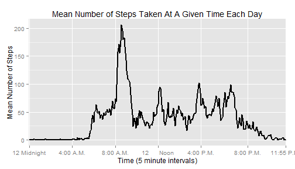
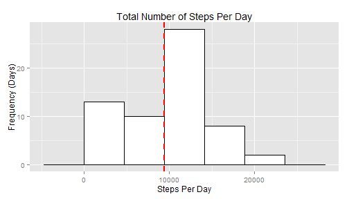
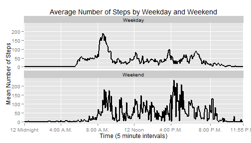

---
title: "PA1_Template.RMD"
author: "Ryan Barley"
date: "Sunday, December 14, 2014"
output: html_document
---


## Loading and preprocessing the data

First, we will see if the user has the packages required to run this code. If they do not, R will install and load them automatically.

```r
if (!(require(ggplot2, quietly=T))) {
  install.packages('ggplot2')
}
library(ggplot2)
```

Then, we will see if the data are already in a suitable place for the code to access them. Once there is a directory set up in the user's WD, then R will download and unzip the data into that directory. The data we are using comes from a personal activity monitoring device. This device collects data at 5 minute intervals through out the day. The data consists of two months of data from an anonymous individual collected during the months of October and November, 2012 and include the number of steps taken in 5 minute intervals each day. 


```r
dir.create("./data", showWarnings=FALSE) 

setInternet2(use = TRUE)
if(!file.exists("./data/household_power_consumption.txt")) {
  url <- "https://d396qusza40orc.cloudfront.net/repdata%2Fdata%2Factivity.zip"
  download.file(url, destfile = "./data/data.zip")
  unzip(zipfile="./data/data.zip", files = NULL, list = FALSE, overwrite = TRUE,
        junkpaths = FALSE, exdir = "./data", unzip = "internal",
        setTimes = FALSE)
}

activity.data <- read.csv("./data/activity.csv", 
                          header = TRUE , 
                          stringsAsFactors = FALSE)
```


```r
activity.data$steps <- as.numeric(activity.data$steps)
activity.data$date <- as.POSIXct(activity.data$date)
activity.data$index <- rep(1:288, times = 61)
```
Here we are simply changing the classes of some of the columns in order to make them easier to work with later. We are also adding an index variable that will help us plot the data.

## What is mean total number of steps taken per day?

In order to find the mean total number of steps per day, we will first use the aggregate() function  to find the total number of steps taken each day.

```r
steps.per.day <- aggregate(steps ~ date, 
                         data = activity.data,
                         sum)
```
Then, we will make a histogram of the total number of steps taken each day

```r
## Find optimal bin-width of histogram using Scott's normal refernce rule
h <- (3.5 * (sd(steps.per.day$steps))) / (nrow(steps.per.day))^(1/3)

## Plot histogram
hist <- ggplot(steps.per.day, aes(x=steps)) +
        geom_histogram(binwidth = h, colour="black", fill="white") +
        xlab("Steps Per Day") + 
        ylab("Frequency (Days)") +
        ggtitle("Total Number of Steps Per Day") +
        geom_vline(aes(xintercept=mean(steps, na.rm=T)),
                   color="red", linetype="dashed", size=1)
hist
```

 


```r
options(scipen=999)
## Mean
mean.steps <- round(mean(steps.per.day$steps, na.rm = TRUE), 2) # 10766.19

## Median
median.steps <- median(steps.per.day$steps, na.rm = TRUE) # 10765
```
The mean of the total steps per day is 10766.19 steps (shown by red dashed line) and the median is 10765 steps.


## What is the average daily activity pattern?

We start off much the same way that we did for the total time, by using aggregate(). This time, we will use the mean function instead of the sum function.

```r
mean.time <- aggregate(steps ~ index, 
                       data = activity.data,
                       mean)
```
Then we will make a time series plot of the 5-minute interval against the average number of steps taken, averaged across all days (which we did above).

```r
g <- ggplot(mean.time, aes(x = index, y = steps, group = 1)) + 
       geom_line(size = 1) + 
       xlab("Time (5 minute intervals)") +
       ylab("Mean Number of Steps") +
       ggtitle("Mean Number of Steps Taken At A Given Time Each Day") +
       scale_x_discrete(breaks=c(1, 49, 97, 145, 193,  245, 288), 
                        labels=c("12 Midnight", "4:00 A.M.", "8:00 A.M.", "12      Noon", "4:00 P.M.", "8:00 P.M.", "11:55 P.M."))
g
```

 

To determine which 5-minute interval, on average across all the days in the dataset, contains the maximum number of steps, we have to add some data back into mean.time. We will do this by using cbind() to add the intervals back into mean.time.


```r
mean.time <- cbind(mean.time, activity.data$interval[1:288])
names(mean.time) <- c("index", "steps", "interval")

max.interval <- mean.time[which.max(mean.time$steps),]$interval
max.steps <- round(max(mean.time$steps), 2)
```
From this we see that the interval with the most number of steps on average is 835, which has 206.17 average steps.


## Imputing missing values

Thus far we have been ignoring the missing values in the data (coded as NA). The presence of missing days may introduce bias into some calculations or summaries of the data. To add them back in, first we will calculate the number of missing values in the dataset, then we will fill them in using the average number of steps for that interval.

From 

```r
count.NA <- sum(is.na(activity.data))
```
We see that there are 2304 missing data points. Which accounts for 13% of the total values. 

Next, we want to replace all of the NA values with the interval averages. We will do this using a simple for loop.


```r
merged.data <- merge(activity.data, mean.time, by = 'index')
for (i in 1:nrow(merged.data)){
  if (is.na(merged.data$steps.x[i])) {
    merged.data$steps.x[i] <- merged.data$steps.y
  }
}
```

Now, we will make a new dataset with all of the missing values filled in.

```r
activity.data.filled <- merged.data[, c(2, 3, 4, 1)]
names(activity.data.filled) <- c("steps", "date", "interval", "index")
```

Next, we will make another histogram, this time showing the total number of steps with the missing values included. We will do it the same way as we did it last time.


```r
full.steps <- aggregate(steps ~ date, 
                        data = activity.data.filled,
                        sum)

## Find optimal bin-width of histogram (again) using Scott's normal refernce rule
h <- (3.5 * (sd(full.steps$steps))) / ((nrow(full.steps))^(1/3))

## Plot histogram
hist2 <- ggplot(full.steps, aes(x=steps)) +
         geom_histogram(binwidth = h, colour="black", fill="white") +
         xlab("Steps Per Day") + 
         ylab("Frequency (Days)") +
         ggtitle("Total Number of Steps Per Day") +
        geom_vline(aes(xintercept=mean(steps, na.rm=T)),
                   color="red", linetype="dashed", size=1)
hist2
```

 

How do these number compare to the data with missing values? We will take the mean and median again and see how they differ.


```r
options(scipen=999)
## Mean:
mean.full <- round(mean(full.steps$steps), 2) # [1] 9419.08
mean.difference <- round((((mean.steps - mean.full) / mean.full) * 100), 2)

## Median
median.full <- median(full.steps$steps) # 10395
median.difference <- round((((median.steps - median.full) / median.full) * 100), 2)
```
The new mean (which is also represented by a red-dashed line in our new histogram) is 9419.08 and the new median is 10395. This represents a percent difference of 14.3% and 3.56%, respectively.
## Are there differences in activity patterns between weekdays and weekends?

Here, we are finally using the date column we converted to as.POSIXct in preprocessing. 


```r
activity.data.filled$day <- weekdays(activity.data.filled$date)
activity.data.filled$day <- ifelse(activity.data.filled$day == c("Saturday", "Sunday"), "Weekend", "Weekday")
activity.data.filled$day <- as.factor(activity.data.filled$day)
full.steps <- aggregate(steps ~ index + day, activity.data.filled, mean)
```
We made a new column called "day" and filled it with the factors "Weekend" and "Weekday". This will tell us whether or not the day it is matched to falls on a weekend or not. Finally, we made an aggregate of the steps and index column (just like our last line plot), but we included the day factor as well.

Finally, we will use this aggregated table to make a panel plot measuring activity during the week against activity during the weekend.


```r
panel <- ggplot(full.steps, aes(x = index, y = steps, group = 1)) + 
  facet_wrap( ~ day, ncol = 1) +
  geom_line(size = 1) + 
  xlab("Time (5 minute intervals)") +
  ylab("Mean Number of Steps") +
  ggtitle("Average Number of Steps by Weekday and Weekend") +
  scale_x_discrete(breaks=c(1, 49, 97, 145, 193,  245, 288), 
                   labels=c("12 Midnight", "4:00 A.M.", "8:00 A.M.", "12 Noon", 
                            "4:00 P.M.", "8:00 P.M.", "11:55 P.M."))
panel
```

 

We see an increased level of activity during the weekend, likely because the subject was not sedentery at a desk all day. We see the same spikes in activity in the morning, at noon, and the evening, which represents some constant activities between the weekdays and the weekend (likely meals). We also see activity spiking much earlier on weekdays, which may mean that the subject was able to sleep in when they did not have to go to work.
